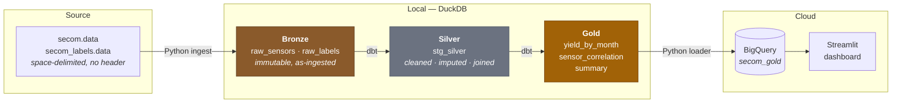
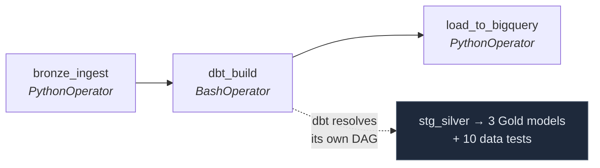

# Semiconductor Yield Platform

An end-to-end data engineering pipeline over real semiconductor manufacturing
sensor data. Raw wafer-test measurements are ingested, cleaned, and aggregated
through a Medallion architecture (Bronze → Silver → Gold), orchestrated with
Apache Airflow, transformed with dbt, loaded into BigQuery, and surfaced in a
Streamlit dashboard.

**The question it answers:** which process sensors are associated with failing
units, and how is yield trending over time?

| | |
|---|---|
| **Dataset** | [SECOM](https://archive.ics.uci.edu/dataset/179/secom) (UCI ML Repository) — 1,567 production units, 590 anonymised sensors, pass/fail label + timestamp |
| **Stack** | Python · Pandas · DuckDB · dbt · Apache Airflow · Docker Compose · Google BigQuery · Streamlit · GitHub Actions |
| **Scale** | ~10 MB. Deliberately single-machine — see [Engineering tradeoffs](#engineering-tradeoffs) |

---

## Architecture



Airflow runs the whole thing as a three-task DAG:



`dbt_build` is a single Airflow task, but internally dbt builds its own
dependency graph from `ref()` calls and runs the three Gold models in parallel
once Silver completes.

---

## Why Medallion

Each layer has one job, which keeps failures diagnosable:

**Bronze** — raw data landed exactly as it arrived. No cleaning, no type
coercion, nothing dropped. When a downstream number looks wrong, Bronze is the
reference point that proves whether the problem came from the source or from
the pipeline. Treated as immutable.

**Silver** — where the data-quality judgment lives. Missing-value handling,
type enforcement, the join between sensor readings and labels. Everything here
is a decision that has to be defensible (see below).

**Gold** — analysis-ready aggregates, one table per business question. This is
the only layer consumers query, so the 560-column Silver table never leaks into
a dashboard.

---

## The data quality problem

SECOM is a genuinely messy real-world dataset: **41,951 missing values** across
590 sensors. That is not an oversight in the data — it is the interesting part,
and it reflects what sensor data from a real fab actually looks like.

The distribution is heavily skewed:

- The typical sensor is missing only **6** of 1,567 readings
- The worst sensor is missing **91.2%** of its readings

A single strategy would be wrong for both ends of that range. Imputing a sensor
that is 91% absent means inventing data; dropping a sensor missing 6 values
throws away a usable signal.

**Decision: drop sensors above 20% missing, median-impute the rest.**
That removes 32 sensors and keeps 558.

The threshold is not arbitrary. Counting how many sensors exceed each candidate
threshold:

| Threshold | Sensors dropped |
|---|---|
| 10% | 52 |
| **20%** | **32** |
| 30% | 32 |
| 40% | 32 |
| 50% | 28 |

The count is flat from 20% through 40% — **no sensor in this dataset has
between 20% and 40% missing values.** The sensors split cleanly into
"almost complete" and "mostly absent," with an empty gap between. 20% sits at
the natural boundary, so the cutoff follows the data's own structure rather
than a round number chosen by preference.

Median rather than mean for imputation: sensor readings contain outliers, and
the median is not dragged by them.

This logic is implemented as a **dbt macro**
([`get_low_missingness_sensors`](dbt/macros/get_low_missingness_sensors.sql)),
which queries the table at compile time and generates the column list. If the
source data changed, the kept-column set updates automatically — no hardcoded
list to maintain.

---

## Results

From the Gold layer:

- **1,567** units, **104** failures — an overall yield of **93.4%**
- Yield by month: **77.8%** (Jul 2008) → **90.8%** → **97.1%** → **93.9%** (Oct 2008)
- The strongest failure-associated sensors are `sensor_161`, `sensor_159`, and
  `sensor_21`, ranked by the absolute difference in mean reading between
  passing and failing units

The 104 failure count matches the figure documented in the original SECOM
dataset description, which is a useful independent check that the pipeline
does not silently drop rows.

> **Note on `mean_difference`:** this is a raw difference of means in each
> sensor's own units, so magnitudes are not comparable across sensors. It is a
> screening tool for "which sensors deserve a closer look," not a statistical
> significance test.

---

## Engineering tradeoffs

Being explicit about these, since a few tools here are larger than this
dataset strictly requires.

**DuckDB, not Spark.** 1,567 rows is far too small to justify distributed
processing. Spark here would add cluster overhead, JVM tuning, and complexity to
process data that fits comfortably in memory. DuckDB is the correct engine at
this scale.

**BigQuery is for the integration pattern, not for compute.** At 10 MB, BigQuery
is not solving a scale problem. It is here to demonstrate the warehouse
integration — service-account auth, schema mapping, idempotent loads. There is
also one genuine architectural benefit: DuckDB is an embedded single-writer
database, so a dashboard holding a connection contends with the pipeline
rebuilding the file. Reading the dashboard from BigQuery removes that contention
and means the app can run somewhere other than a laptop. In production the real
drivers would be concurrency and scale — not compute limits at this volume.

**`sys.path` insertion instead of packaging.** The DAG imports pipeline code by
adding `scripts/` to `sys.path`. For a three-task single-environment pipeline
that is proportionate. At production scale the transformation code would be an
installable package baked into a custom Airflow image, rather than mounted and
path-injected.

**`_PIP_ADDITIONAL_REQUIREMENTS` for container dependencies.** This reinstalls
packages on every container start, which the Airflow docs explicitly flag as
development-only. The production approach is a custom image with dependencies
built in. Acceptable here because startup cost is irrelevant for local runs.

---

## Data quality tests

`dbt build` runs 4 models and 10 tests on every pipeline execution and in CI:

- `label` is never null and only ever `-1` (pass) or `1` (fail)
- `timestamp` is never null
- `month` and `sensor` are unique across their respective Gold tables
- Key measures are non-null

A failing test fails the Airflow task, so bad data stops at the pipeline rather
than reaching the dashboard.

---

## Continuous integration

[GitHub Actions](.github/workflows/ci.yml) runs on every push to `main` and on
pull requests:

1. Install dependencies from scratch on a clean Ubuntu runner
2. Lint with `ruff`
3. Run Bronze ingestion
4. Run `dbt build` — 4 models + 10 data tests

The BigQuery load and the dashboard are deliberately **excluded** from CI: both
require a service-account key, and storing a live cloud credential in CI is not
a worthwhile tradeoff for this project. What CI does cover is the part most
likely to regress — ingestion, the missingness macro, imputation, joins,
aggregations, and the data tests — proven to work from a clean checkout with
nothing but `requirements.txt`.

---

## Running it locally

**Prerequisites:** Python 3.13, Docker Desktop, and (for the cloud steps) a GCP
project with BigQuery enabled.

### Core pipeline — no cloud account needed

```bash
python -m venv .venv && source .venv/bin/activate
pip install -r requirements.txt

python scripts/bronze_ingest.py          # raw → Bronze (DuckDB)
cd dbt && dbt build --profiles-dir .     # Bronze → Silver → Gold, plus tests
```

Output lands in `data/secom_dbt.duckdb`.

### Orchestrated with Airflow

```bash
mkdir -p dags logs plugins config
echo "AIRFLOW_UID=$(id -u)" > .env
echo "_PIP_ADDITIONAL_REQUIREMENTS=pandas duckdb dbt-core dbt-duckdb google-cloud-bigquery" >> .env

docker compose up airflow-init
docker compose up -d
```

Open http://localhost:8080 (`airflow` / `airflow`), find `secom_pipeline`, and
trigger it.

### BigQuery + dashboard

Requires a GCP service-account key with BigQuery access, stored **outside the
repository**:

```bash
mkdir -p ~/.gcp
mv ~/Downloads/<your-key>.json ~/.gcp/secom-key.json
chmod 600 ~/.gcp/secom-key.json
```

Update `PROJECT_ID` in `scripts/load_to_bigquery.py` and `dashboard/app.py` to
your own project, then:

```bash
python scripts/load_to_bigquery.py
streamlit run dashboard/app.py
```

The key path is resolved from the `GCP_KEY_PATH` environment variable, falling
back to `~/.gcp/secom-key.json`, so the same code runs unchanged on a laptop and
inside the Airflow containers. No credentials are committed to this repository.

---

## Repository layout

```
├── dags/                  Airflow DAG definition
├── dbt/
│   ├── models/staging/    stg_silver — cleaning, imputation, join
│   ├── models/marts/      three Gold models + schema tests
│   └── macros/            dynamic missingness-threshold column selection
├── scripts/
│   ├── bronze_ingest.py   raw files → Bronze tables
│   └── load_to_bigquery.py  Gold → BigQuery
├── dashboard/app.py       Streamlit dashboard
├── notebooks/             initial exploratory analysis
├── data/                  SECOM source files + DuckDB databases
└── .github/workflows/     CI
```
